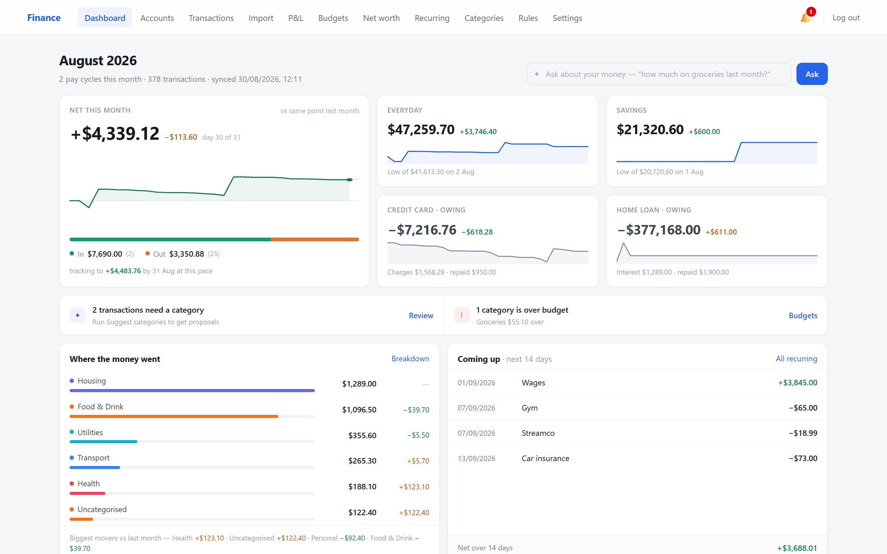
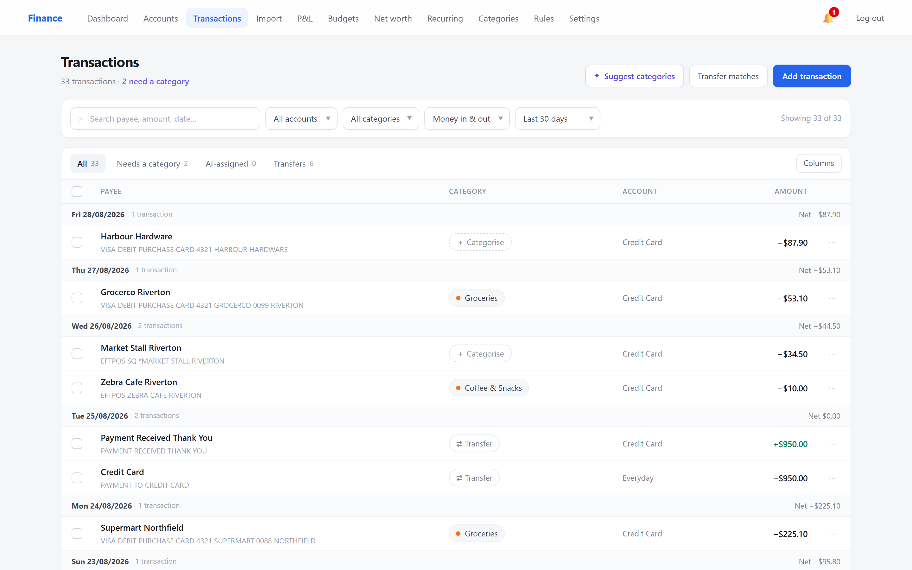
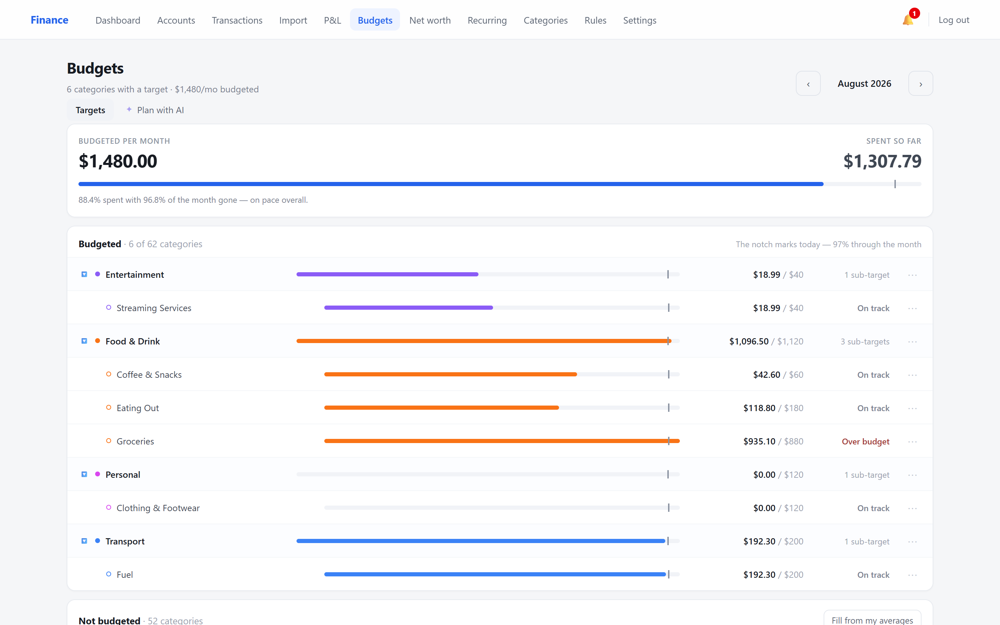
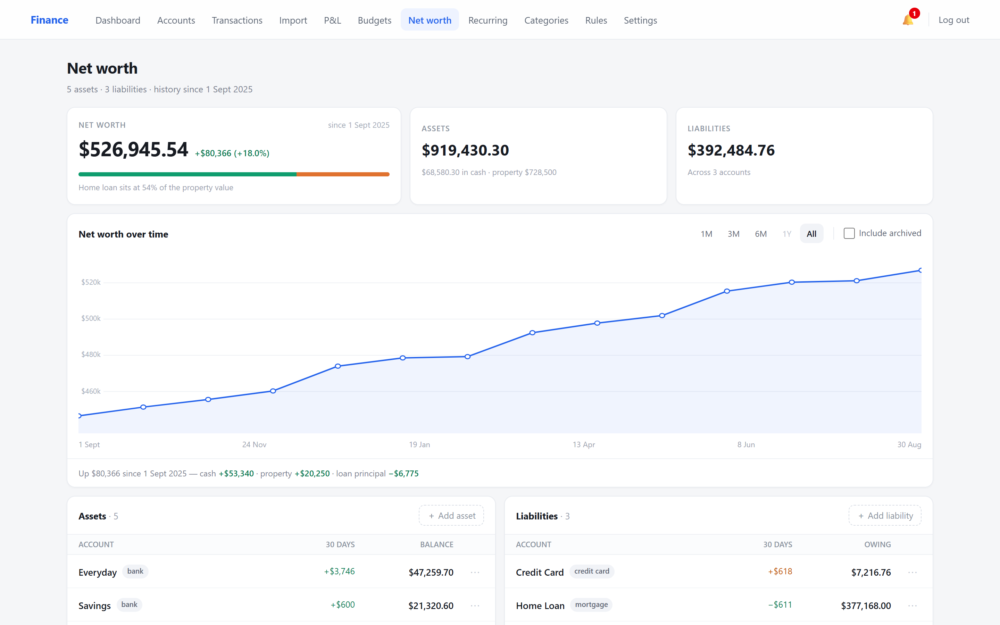
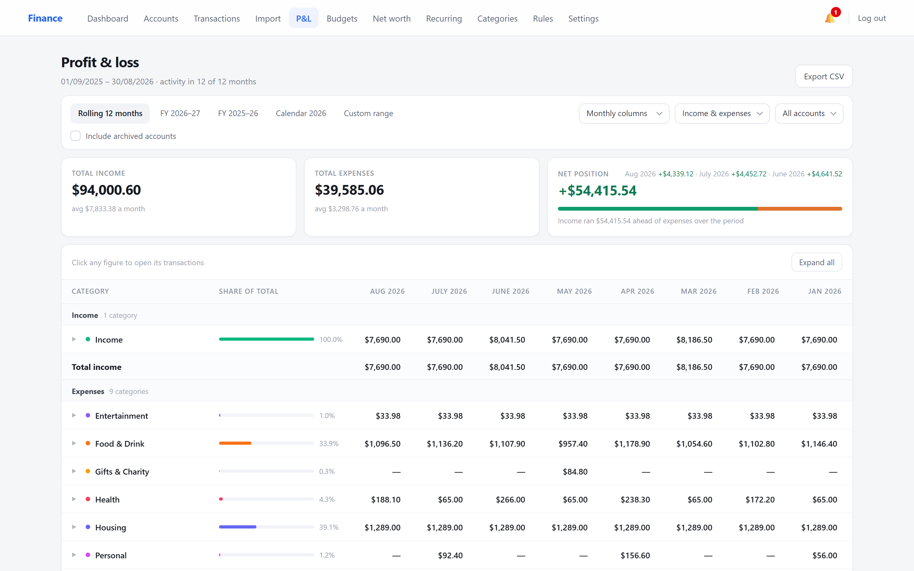
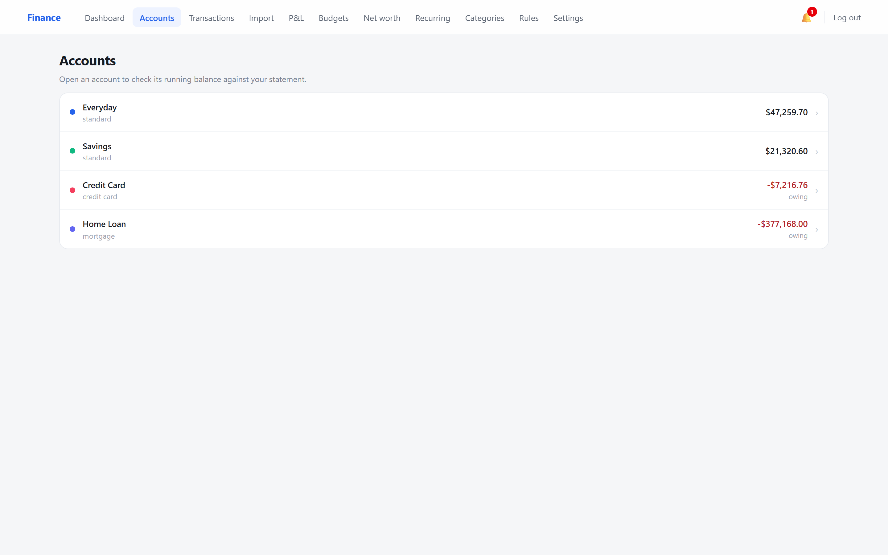
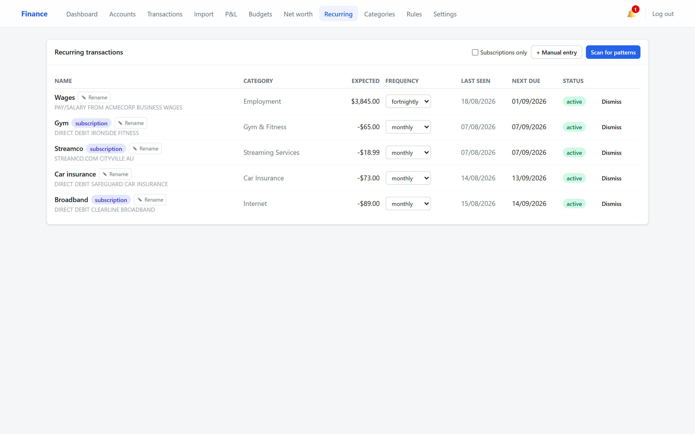
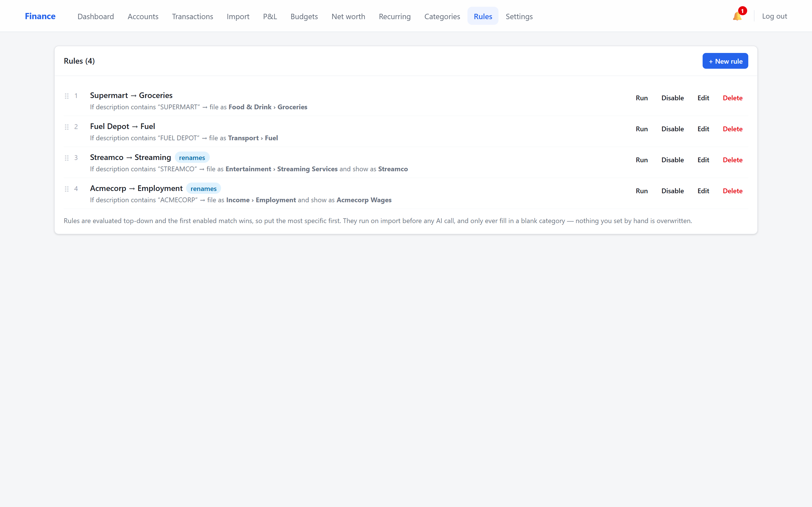

# Another Finance App

Self-hosted single-user personal finance tracker (AUD) with AI-assisted categorisation,
recurring detection, CSV import, P&L and net worth views.

Your data stays on your own server: PostgreSQL on the same box, no third-party
analytics, and no outbound calls except the Anthropic API when you enable the
optional AI features (which is server-side only — your API key never reaches the
browser).

## Screenshots

Every figure below is generated demo data — invented merchants, invented employer,
invented balances. Reproduce it with `node seed-demo.mjs` against a throwaway database
(see [Demo data](#demo-data)).

### Dashboard

Net position for the month, per-account sparklines, what needs attention, and where
the money actually went.



### Transactions

Grouped by day with running net, the raw bank description kept under the cleaned-up
payee, and inline categorisation.



### Budgets

Targets measured over their own period, with a shared pace notch marking how far
through the month you are — so "spent 88%" reads against "96% of the month gone"
rather than against nothing.



### Net worth

Accounts plus the things that aren't accounts — super, property, vehicles, private
loans — valued over time, so a revaluation never rewrites history.



### Profit & loss

Rolling 12 months or a financial year, by category, with transfers and mortgage
principal excluded so the totals mean what they say.



<details>
<summary>More screens — accounts, recurring, rules</summary>







</details>

## Stack

React 18 + TypeScript + Vite + Tailwind (frontend) · Node 20 + Fastify (backend) ·
PostgreSQL 16 · Anthropic Claude API (server-side only) · Nginx + systemd (deploy).

## Local development

```bash
createdb finance
cp .env.example .env            # set DATABASE_URL + SESSION_SECRET
npm install
npm run migrate                 # node-pg-migrate, SQL files in backend/migrations
DATABASE_URL=postgresql:///finance npm run dev:backend
npm run dev:frontend            # Vite on :5173, proxies /api to :3000
```

First visit shows the one-time setup wizard (user, API key, accounts, optional import).

```bash
npm test                        # backend CSV parser self-checks
```

## Demo data

`seed-demo.mjs` fills an empty database with twelve months of invented activity —
four accounts, ~380 transactions, holdings, budgets, goals, recurring entries and
rules. It's what the screenshots above show, and it's the fastest way to see whether
the app is worth your time before importing anything real.

It **truncates every table first**, so point it at a throwaway database only:

```bash
DATABASE_URL=postgresql:///finance_demo node seed-demo.mjs
```

Then sign in as `demo` / `demo-password-2026`.

## Production (Ubuntu Server, no containers)

See `docs/`: `nginx.conf`, `finance-api.service`, `deploy.sh`, `backup.sh`, `restore.md`.
Secrets live in `/etc/finance/.env` (root-owned, mode 640, group `finance`).

- Health: `GET /api/health`
- Logs: `journalctl -u finance-api -f`
- Locked out after failed logins: `npm run unlock -- <username>` in `backend/`
- Forgotten password: `npm run set-password -- <username> '<new password>'` in `backend/`
- Backups: Settings → Backup downloads a full dump; `docs/backup.sh` still runs on cron

## CHANGELOG

### 1.0.0
Initial release: accounts, transactions, CSV import (signed-amount and Debit/Credit presets),
transfers, categories, rules, AI categorisation/analysis/NL query, recurring detection,
alerts, bulk ops with undo, dashboard, P&L, net worth, audit log, first-run wizard.

## CSV import

Two layouts are auto-detected, covering most Australian bank exports:

- **Signed amount** — no header row, one amount column, expenses negative
- **Debit / Credit** — header row, separate debit and credit columns

The column mapping you confirm is remembered per account. Dates are read as
dd/mm/yyyy. Credit-card debits negate, so a purchase increases what you owe.

## Licence

MIT — see [LICENSE](LICENSE).
